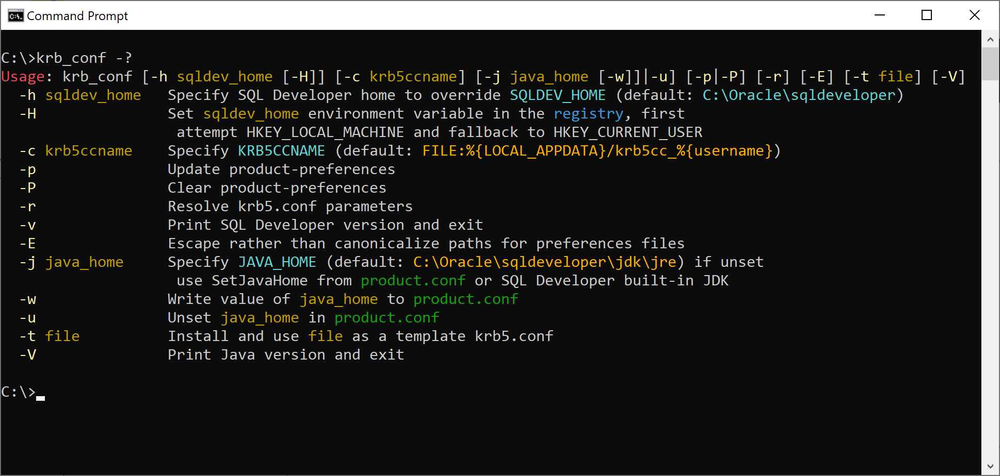
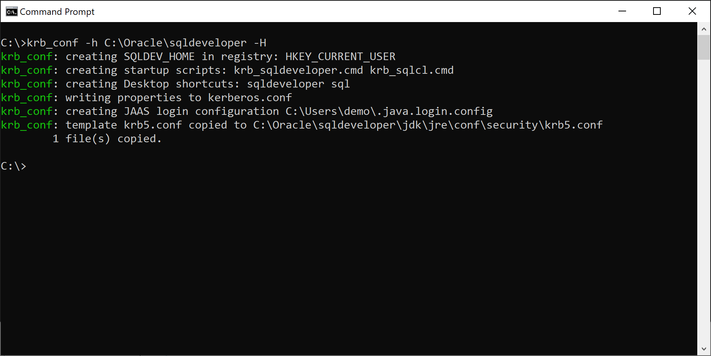
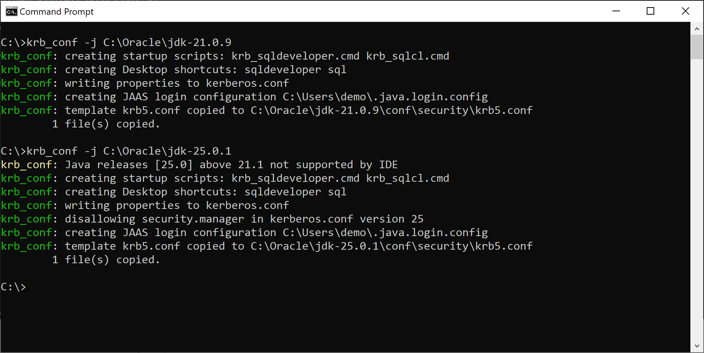
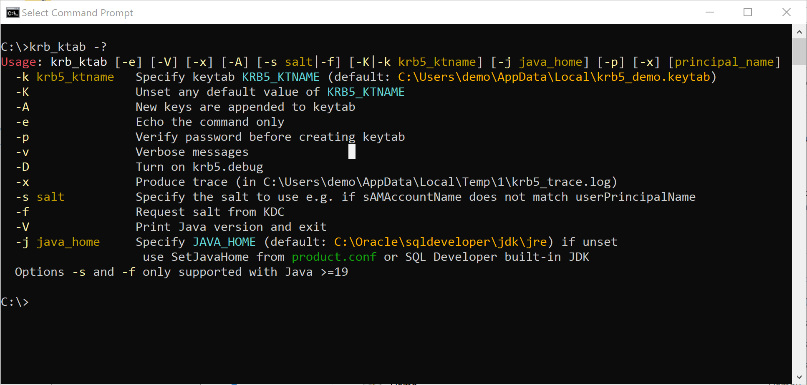
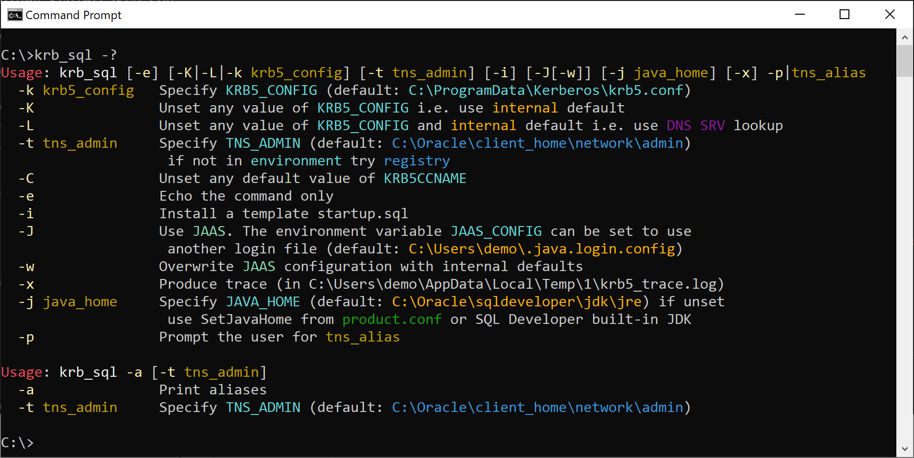

# SQL Developer Kerberos Utiltities

These tools are for the special cases on Windows where it is not possible to use the LSA as a ticket cache for authentication. They also assist in simplifying what is a fairly complex process in ensuring that the settings are correct for authentication with Kerberos for SQL Developer and SQLcl.

Some enhanced functioanilty requires the installation of [Git for Windows](https://git-scm.com/downloads/win). Ensure to select the Unix tools option. 

<p align="center" spacing="10">
    <kbd>
        
    </kbd>
</p>


To use the **krb_pkinit** tool the MIT Kerberos distribution needs to be installed. To use PKINIT, it will be necessary to [build](#Building-MIT-Kerberos-with-PKINIT-Enabled-for-Windows-11) the MIT Kerberos Windows installable package with PKINIT enabled.

> **_NOTE:_**  These tools specifically discuss using Kerberos within Java (GSS-API or JAAS) with SQL Developer and SQLcl (*thin client*s) and not Kerberos with OCI (*thick client*) from the Oracle Client or Instantclient.

The tools offer the possibility of simplified passwordless login to via Kerberos to databases and other services.

There are various defaults for cache location and type, configuration file location, sequences for authentication attempts and so on in-built to Windows Kerberos, MIT, Heimdal and the mechanisms within SQL Developer. This package aims to produce consistent behaviour when using an amalgam of these implemntations such that authentication is simplified and consistent.


## Installation

Copy the software somewhere, say `C:\Program Files\sqldev_krb`. Put `C:\Program Files\sqldev_krb\bin` in the PATH. 

Set `SQLDEV_HOME` to the root location of the SQL Developer installation to avoid excess typing.

If the _userPrincipalName_ differs from the _sAMAccountName_ within Active Directory a later version of the JDK (17+) must be used to exploit the later features of the **ktab** command.

## Quick Start


### Configuration

The first step is to generate the files required for configuration. This is done with **krb_conf**. Note that `SQLDEV_HOME` must be set in the environment or supplied on the command line with **-h** (add **-H** to write to the registry). In this example of the output of the usage message we can see that the former is the case.

<p align="center" spacing="10">
    <kbd>
        
    </kbd>
</p>

Exceuting will generate a basic configuration for the user:

<p align="center" spacing="10">
    <kbd>
        
    </kbd>
</p>

A default `krb5.conf` file is generated by the tool unless you install your own template with the **-t** option. This template file will be used on subsequent invocations of **krb_conf**:

<p align="center" spacing="10">
    <kbd>
        
    </kbd>
</p>

If we wish to configure SQL Developer to use an external JDK (although this is no a requirement) this can be done with the **-j** flag.

Note that if you attempt to use a JDK later than 21.1 a warning will be issued. 

<p align="center" spacing="10">
    <kbd>
        
    </kbd>
</p>

Two Desktop shortcuts will be intalled.

For **SQL Developer**:
<p align="center" spacing="10">
    <kbd>
        
    </kbd>
</p>

and **SQLcl**:
<p align="center" spacing="10">
    <kbd>
        
    </kbd>
</p>

### Create a Keytab

We have the option for JAAS to use a keytab to create its own credential cache.

<p align="center" spacing="10">
    <kbd>
        
    </kbd>
</p>

In this example, we specify a later Java home in order that the **-f** option can be used to fetch the seed used for the principal from the KDC.

<p align="center" spacing="10">
    <kbd>
        
    </kbd>
</p>

We can list the keytab:

<p align="center" spacing="10">
    <kbd>
        
    </kbd>
</p>

by specifying **-k**:

<p align="center" spacing="10">
    <kbd>
        
    </kbd>
</p>

### Connection

Next, check that you can connect with SQLcl. Here are the options:

<p align="center" spacing="10">
    <kbd>
        
    </kbd>
</p>

In this example, `KRB5_CONFIG` is already set in the environment to somewhere we don't want. Hence we override it with **-K**. Be sure to use JAAS (**-J**) as this is what SQL Developer IDE uses:

<p align="center" spacing="10">
    <kbd>
        
    </kbd>
</p>


## Background

In general, there are two mechanisms possible to achieve passwordless login when the user has not been automatically authenticated to the realm upon login, for example, via PAM/sshd on UNIX/Linux systems or via login to a Windows domain.

### PKINIT

This mechanism uses a *certifcate* and its private key to preauthenticate the session and obtain tickets for the ticket cache. This is the technique used also by smartcards. They private key may or may not have password or other protection.

### Keytab

In this scenario the user authenticates to the realm (domain) and creates a *keytab*. This keytab can subsequentally be used to obtain tickets for a ticket cache without being challenged for a password. The keytab file should, needless to say, be stored for each user where others are not able to access it.


### SQL Developer

These tools primarily make use of the JDK supplied with SQL Developer to afford login via the main GUI and its standalone SQL editor **SQLcl**.

SQL Developer's connection facilties for Kerberos are roughly outlined in section [2.20.5](https://docs.oracle.com/en/database/oracle/sql-developer/24.3/rptug/sql-developer-concepts-usage.html#GUID-F7C2BC27-20FB-4F0B-AB66-A104DB3F0090) of the User Guide:

**Kerberos Thin Config: Config File:** Kerberos configuration file (for example, krb5.conf). If this is not specified, default locations will be tried for your Java and system configuration.

**Kerberos Thin Config: Credential Cache File:** Kerberos credential cache file (for example, krb5_cc_cache). If this is not specified, a cache will not be used, and a principal name and password will be required each time.

The Kerberos utilities provided by the JDK are minimalist in nature and have idiosyncratic behaviour. So, these programs make allowances for this to ensure a reliable process to authenticate. 

> **_NOTE:_** SQL Developer itself uses JAAS. This greatly simpfies login as the need to maintain a credentials cache is obviated.


#### JDK - Supplied

At the root of the SQL Developer installation, subsequently referred to as `SQLDEV_HOME` the shipped JDK is found:

<pre class=console><code>SQLDEV_HOME\jdk\
jre\     
 ├─bin\ 
 │  ├─<b>kinit</b>.exe 
 │  ├─<b>klist</b>.exe 
 │  └─<b>ktab</b>.exe 
 │
 ├─conf\ 
 │  ├─...
 │  ├─security 
 │  │  ├─<b>java.security</b>
 │  │  └─krb5.conf
 │  └─... 
 │
 ├─lib\ 
 └─...
</code></pre>

The three Kerberos utilities provided **kinit**, **klist** and **ktab** are to be found. These do have divergent operation from the MIT or Heimdal counterparts.

##### java.security

In addition the `java.security` file is to be found here. In this we might configure a default login configuration file for JAAS should we choose to use this mechanism.

The default (commented) is set as:
```shell output
#login.config.url.1=file:${user.home}/.java.login.config
```

##### krb5.conf

Although no default `krb5.conf` is distributed, this is the default location where SQL Developer will search should you choose to create one here.

#### JDK - External

Using an external JDK is supported by SQL Developer. However, only versions up to 21.1 are supported:

<p align="center" spacing="10">
    <kbd>
        
    </kbd>
</p>

The **krb_conf** utility will make the appropriate checks when configuring SQL Developer to use an external JDK.


## Obtaining Credentials 

We shall consider the two mechanisms: PKINIT and the use of a keytab. Of the two, PKINIT is the more complex as we shall need an external implementation of **kinit** with PKINIT support compiled in. Neither **kinit** from the SQL Developer JDK nor **okinit** supplied with the Oracle client have this feature.

As the simplest proposition, the use of a keytab is therefore discussed first.

### Method 1 - Keytab

The first step in creating a passwordles login is to create a keytab. This
file should be placed in a safe location where no other users are able to read
it.

<pre class=console><code>> <b>krb_keytab -p</b>
Password for demo@EXAMPLE.COM:<b>*********</b>
Done!
Service key for demo@EXAMPLE.COM is saved in C:\Users\demo\AppData\Local\krb5_demo.keytab
</code></pre>

> **_NOTE:_**  It is stronly recommended to use the **-p** option to validate the password otherwise a keytab will be generated using an incorrect password - such a keytab can still be used but will fail any attempts to use it for authentication (with **kinit** or JAAS).

A prompt will be made for the password (whether specifying **-p** or not) and the subsequent typing will not be masked: so be careful that no-one else is watching the screen.

The *default* location for the keytab is `%LOCALAPPDATA%\krb5_%USERNAME%.keytab`.

Having created a keytab we can view its contents, using the **-k** option to **krb_klist** to display the default keytab:

<pre class=console><code>> <b>krb_klist -k</b>

Key tab: C:\Users\demo\AppData\Local\krb5_demo.keytab, 4 entries found.

[1] Service principal: demo@EXAMPLE.COM
         KVNO: 1
         Key type: 18
         Key: 0x12886815a6cf1501b6306d9e672f034ff7a742f9800a7a1086a2b7c991e9dc62
         Time stamp: Oct 14, 2025 12:47:57
[2] Service principal: demo@EXAMPLE.COM
         KVNO: 1
         Key type: 17
         Key: 0x42cf1f44356f976a9d2b5a62d7019796
         Time stamp: Oct 14, 2025 12:47:57
[3] Service principal: demo@EXAMPLE.COM
         KVNO: 1
         Key type: 20
         Key: 0x07eb0fc6ba22bed9b3b2553c4385f5c80c93b2efb3c4156aa891b9f34029759a
         Time stamp: Oct 14, 2025 12:47:57
[4] Service principal: demo@EXAMPLE.COM
         KVNO: 1
         Key type: 19
         Key: 0xe53fad914e58f3735c794df63507c52c
         Time stamp: Oct 14, 2025 12:47:57
</code></pre>

If the tool we are using requires a credentials cache we can generate one from the keytab. In most cases this won't be necessary as the keytab can be used to generate the credentials which are stored in memory. This step involves requesting a ticket (to store in our credentials cache.) We can do this with **krb_kinit** by specifiying the **-k** option to tell it to use a keytab (either specified or the default one):

<pre class=console><code>> <b>krb_kinit -k</b>
New ticket is stored in cache file C:\Users\demo\AppData\Local\krb5cc_demo
</code></pre>

Note the default credentials cache is `%LOCALAPPDATA%\krb5cc_%USERNAME%`. 


### Method 2 - PKINIT

We do not need to create a keytab for the user for this procedure.
 
Having obtained the certificate `%USERNAME%.crt`, key `%USERNAME%.key` and root certificate `ca.crt` files and placed them in `%USERPROFILE%\Certs`, run the following:

<pre class=console><code>> <b>krb_pkinit</b>
New ticket is stored in cache file C:\Users\demo\AppData\Local\krb5cc_demo
</code></pre>

### Listing the Contents of the Credentials Cache

We can list the contents of the default credentials cache thus:

<pre class=console><code>> <b>krb_klist</b>

Credentials cache: C:\Users\demo\AppData\Local\krb5cc_demo

Default principal: demo@EXAMPLE.COM, 1 entry found.

[1]  Service Principal:  krbtgt/EXAMPLE.COM@EXAMPLE.COM
     Valid starting:     Oct 14, 2025 13:12:13
     Expires:            Oct 14, 2025 23:12:13
     EType (skey, tkt):  AES256 CTS mode with HMAC SHA1-96, AES256 CTS mode with HMAC SHA1-96
     Flags:              INITIAL;PRE-AUTHENT
</code></pre>

## Using SQL Developer GUI

To set up the environment for Kerberos for SQL Developer

<pre class=console><code>> <b>krb_conf -p -h C:\Oracle\sqldeveloper</b>
krb_conf: creating startup scripts: krb_sqldeveloper.cmd krb_sqlcl.cmd
krb_conf: creating Desktop shortcuts: sqldeveloper sql
krb_conf: writing properties to kerberos.conf
krb_conf: updating preferences:
   Config File (krb5.conf)  C:/Oracle/sqldeveloper/jdk/jre/conf/security/krb5.conf
   Credential Cache File    C:/Users/demo/AppData/Local/krb5cc_demo
   Use Oracle Client        unchanged
   Use OCI/Thick driver     unset
krb_conf: creating JAAS login configuration C:\Users\demo\.java.login.config
krb_conf: template krb5.conf copied to C:\Oracle\sqldeveloper\jdk\jre\conf\security\krb5.conf
        1 file(s) copied.
</code></pre>

This will set appropriate configuration parameters and files and create scripts. If Git for Windows is installed it will also create
a shortcut on the Desktop to this script and set the SQL Developer preferences.


## Using SQLcl

### JDBC

This is the default mode. The following command simply ensures that the settings are appropriate for the intended Kerberos authntication we have configured.

<pre class=console><code>> <b>krb_sql -k C:\Oracle\sqldeveloper\jdk\jre\conf\security\krb5.conf -t C:\Oracle\network\admin OMS</b>


SQLcl: Release 24.3 Production on Wed Oct 15 14:06:11 2025

Copyright (c) 1982, 2025, Oracle.  All rights reserved.

Connected to:
Oracle Database 19c Enterprise Edition Release 19.0.0.0.0 - Production
Version 19.27.0.0.0

SQL> 
</code></pre>

### Java Authentication and Authorization Service (JAAS)

JAAS authentication is performed in a pluggable fashion, so Java applications can remain independent from underlying authentication technologies. Configuration information such as the desired authentication technology is specified at runtime. 

The [configuration file](https://docs.oracle.com/en/java/javase/17/security/appendix-b-jaas-login-configuration-file.html#GUID-7EB80FA5-3C16-4016-AED6-0FC619F86F8E) consists of a number of entries defining the methods and options.

For example, suppose we have the following file `%HOMEPATH%\.java/login.config`:
```shell output
Oracle {
  com.sun.security.auth.module.Krb5LoginModule required
  refreshKrb5Config=true
  doNotPrompt=true
  useTicketCache=true
  ticketCache="FILE:${user.home}/AppData/Local/krb5cc_${user.name}"
  useKeyTab=true
  keyTab="FILE:${user.home}/AppData/Local/krb5_${user.name}.keytab"
  principal="demo@EXAMPLE.COM"
  storeKey=false
  renewTGT=false
  debug=false;
};
```
The following command shows login to SQLcl using JAAS (**-J**)

<pre class=console><code>> <b>krb_sql -J -x -k C:\Oracle\sqldeveloper\jdk\jre\conf\security\krb5.conf -t C:\Oracle\network\admin OMS</b>

Picked up JAVA_TOOL_OPTIONS: -Djava.security.auth.login.config=C:\Users\demo\.java.login.config -Doracle.net.KerberosJaasLoginModule=Oracle


SQLcl: Release 24.3 Production on Wed Oct 15 13:47:27 2025

Copyright (c) 1982, 2025, Oracle.  All rights reserved.

Debug is  true storeKey false useTicketCache true useKeyTab false doNotPrompt true ticketCache is null isInitiator true KeyTab is null refreshKrb5Config is true principal is null tryFirstPass is false useFirstPass is false storePass is false clearPass is false
Refreshing Kerberos configuration
Acquire TGT from Cache
Principal is demo@EXAMPLE.COM
Commit Succeeded

Connected to:
Oracle Database 19c Enterprise Edition Release 19.0.0.0.0 - Production
Version 19.27.0.0.0

SQL>
</code></pre>

If the JAAS configuration file does not exist a basic template will be created. The **-x** option will generate the JAAS configuration with `Debug=true` as can be seen in the output from the command startup.

Note that appropriate Java properties have been set in the `JAVA_TOOL_OPTIONS` environment variable.

### Echo Mode

A useful way to check what wil be run is to use the *echo* mode to print the command and any factors affecting execution:


<pre class=console><code>> <b>krb_sql -e -J -x -k C:\Oracle\sqldeveloper\jdk\jre\conf\security\krb5.conf -t C:\Oracle\network\admin OMS</b>
KRB5_CONFIG=C:\Oracle\sqldeveloper\jdk\jre\conf\security\krb5.conf
KRB5CCNAME=C:\Users\demo\AppData\Local\krb5cc_demo
TNS_ADMIN=C:\Oracle\network\admin
JAVA_TOOL_OPTIONS: -Djava.security.auth.login.config=C:\Users\demo\.java.login.config -Doracle.net.KerberosJaasLoginModule=Oracle
sql -kerberos -thin -noupdates -tnsadmin C:\Oracle\network\admin -krb5_config C:\Oracle\sqldeveloper\jdk\jre\conf\security\krb5.conf -krb5ccname C:\Users\demo\AppData\Local\krb5cc_demo /@OMS
</code></pre>

Another example - this shows that without overriding the location of the kerberos configuration file setting from the command line (**-k**) the system configuration file has been picked up from the environment variable `KRB5_CONFIG`. This may not give us the login required.

<pre class=console><code>> <b>krb_sql -e -J -x -t C:\Oracle\network\admin OMS</b>
KRB5_CONFIG=C:\ProgramData\Kerberos\krb5.conf
KRB5CCNAME=C:\Users\demo\AppData\Local\krb5cc_demo
TNS_ADMIN=C:\Oracle\network\admin
JAVA_TOOL_OPTIONS: -Djava.security.auth.login.config=C:\Users\demo\.java.login.config -Doracle.net.KerberosJaasLoginModule=Oracle
sql -kerberos -thin -noupdates -tnsadmin C:\Oracle\network\admin -krb5_config C:\ProgramData\Kerberos\krb5.conf -krb5ccname C:\Users\demo\AppData\Local\krb5cc_demo /@OMS
</code></pre>

### Defaults

In common with the other programs in this package, type the [help](#krb_sql) option (-?) to see the defaults.


## Program Synopses

### krb_conf
```text
Usage: krb_conf [-h sqldev_home [-H]] [-c krb5ccname] [-j java_home [-w]]|-u] [-p|-P] [-r] [-E] [-t file] [-V]
  -h sqldev_home   Specify SQL Developer home to override SQLDEV_HOME (default: C:\Oracle\sqldeveloper)
  -H               Set sqldev_home environment variable in the registry, first
                    attempt HKEY_LOCAL_MACHINE and fallback to HKEY_CURRENT_USER
  -c krb5ccname    Specify KRB5CCNAME (default: FILE:%{LOCAL_APPDATA}/krb5cc_%{username})
  -p               Update product-preferences
  -P               Clear product-preferences
  -r               Resolve krb5.conf parameters
  -v               Print SQL Developer version and exit
  -E               Escape rather than canonicalize paths for preferences files
  -j java_home     Specify JAVA_HOME (default: C:\Oracle\sqldeveloper\jdk\jre) if unset
                    use SetJavaHome from product.conf or SQL Developer built-in JDK
  -w               Write value of java_home to product.conf
  -u               Unset java_home in product.conf
  -t file          Install and use file as a template krb5.conf
  -V               Print Java version and exit
```

### krb_destroy
```text
Usage: krb_kdestroy [-c] [-k]
  -c               Specifies credential cache KRB5CCNAME (default: C:\Users\demo\AppData\Local\krb5cc_demo)
                   this is the default action if neither -c nor -k are specified
  -k               Specifies keytab KRB5_KTNAME (default: C:\Users\demo\AppData\Local\krb5_demo.keytab)
  -e               Echo the command only
```

### krb_kinit
```text
Usage: krb_kinit [-e] [-D] [-V] [-M|-j java_home] [-x] [-C|-c krb5ccname] [-K|-k [-t krb5_ktname]] [principal_name]
  -c krb5ccname    Specify KRB5CCNAME (default: C:\Users\demo\AppData\Local\krb5cc_demo)
  -C               Unset any default value of KRB5CCNAME
  -k               Use default keytab KRB5_KTNAME (default: C:\Users\demo\AppData\Local\krb5_demo.keytab)
  -t krb5_ktname   Specify keytab with krb5_ktname
  -K               Unset any default value of KRB5_KTNAME
  -e               Echo the command only
  -x               Produce trace (in C:\Users\demo\AppData\Local\Temp\1\krb5_trace.log)
  -D               Turn on krb5.debug
  -M               Use MIT Kerberos
  -j java_home     Specify JAVA_HOME (default: C:\Oracle\sqldeveloper\jdk\jre) if unset
                    use SetJavaHome from product.conf or SQL Developer built-in JDK
  -V               Print Java version and exit
```

### krb_klist
```text
Usage: krb_klist [-M|-j java_home] [-e] [-V] [-c|-k] [name]
  -c               Specifies credential cache KRB5CCNAME (default: C:\Users\demo\AppData\Local\krb5cc_demo)
  -k               Specifies keytab KRB5_KTNAME (default: C:\Users\demo\AppData\Local\krb5_demo.keytab)
  -e               Echo the command only
  -x               Produce trace (in C:\Users\demo\AppData\Local\Temp\1\krb5_trace.log)
  -D               Turn on krb5.debug
  -M               Use MIT Kerberos
  -V               Print Java version and exit
  -j java_home     Specify JAVA_HOME (default: C:\Oracle\sqldeveloper\jdk\jre) if unset
                    use SetJavaHome from product.conf or SQL Developer built-in JDK
  name             The cache or keytab of which to list the contents
When no cache or keytab is specified the default action is to search for all credential caches
```

### krb_ktab
```text
Usage: krb_ktab [-e] [-V] [-x] [-A] [-s salt|-f] [-K|-k krb5_ktname] [-j java_home] [-p] [-x] [principal_name]
  -k krb5_ktname   Specify keytab KRB5_KTNAME (default: C:\Users\demo\AppData\Local\krb5_demo.keytab)
  -K               Unset any default value of KRB5_KTNAME
  -A               New keys are appended to keytab
  -e               Echo the command only
  -p               Verify password before creating keytab
  -v               Verbose messages
  -D               Turn on krb5.debug
  -x               Produce trace (in C:\Users\demo\AppData\Local\Temp\1\krb5_trace.log)
  -s salt          Specify the salt to use e.g. if sAMAccountName does not match userPrincipalName
  -f               Request salt from KDC
  -V               Print Java version and exit
  -j java_home     Specify JAVA_HOME (default: C:\Oracle\sqldeveloper\jdk\jre) if unset
                    use SetJavaHome from product.conf or SQL Developer built-in JDK
  Options -s and -f only supported with Java >=19
```

### krb_pkinit
```text
Usage: krb_pkinit [-e] [-x] [-C|-c krb5ccname>] [-d dir] [-D dir] [-A dir]
  -c krb5ccname    Specify KRB5CCNAME (default: C:\Users\demo\AppData\Local\krb5cc_demo)
  -C               Unset any default value of KRB5CCNAME
  -d               Directory dir in which to find certificate (demo.crt)
  -D               Directory dir in which to find key (demo.key)
  -A               Directory dir in which to find anchor certificate (ca.crt)
  -e               Echo the command only
  -x               Produce trace (in C:\Users\demo\AppData\Local\Temp\1\krb5_trace.log)
 Default dir is C:\Users\demo\Certs
```

### krb_sql
```text
Usage: krb_sql [-e] [-K|-L|-k krb5_config] [-t tns_admin] [-i] [-J[-w]] [-j java_home] [-x] -p|tns_alias
  -k krb5_config   Specify KRB5_CONFIG (default: C:\ProgramData\Kerberos\krb5.conf)
  -K               Unset any value of KRB5_CONFIG i.e. use internal default
  -L               Unset any value of KRB5_CONFIG and internal default i.e. use DNS SRV lookup
  -t tns_admin     Specify TNS_ADMIN (default: C:\Oracle\network\admin)
                    if not in environment try preferences then try registry
  -C               Unset any default value of KRB5CCNAME
  -e               Echo the command only
  -i               Install a template startup.sql
  -J               Use JAAS. The environment variable JAAS_CONFIG can be set to use
                    another login file (default: C:\Users\demo\.java.login.config)
  -w               Overwrite JAAS configuration with internal defaults
  -x               Produce trace (in C:\Users\demo\AppData\Local\Temp\1\krb5_trace.log)
  -j java_home     Specify JAVA_HOME (default: C:\Oracle\sqldeveloper\jdk\jre) if unset
                    use SetJavaHome from product.conf or SQL Developer built-in JDK
  -p               Prompt the user for tns_alias

Usage: krb_sql -a [-t tns_admin]
  -a               Print aliases
  -t tns_admin     Specify TNS_ADMIN (default: C:\Oracle\network\admin)
```

## Building MIT Kerberos with PKINIT Enabled for Windows 11 

Create the following folders:

```Batchfile
mkdir %HOMEPATH%\Src
mkdir %HOMEPATH%\Build\krb5
```

### MIT Kerberos 5 Prerequisites

* [Visual Studio 2022 Community ](https://visualstudio.microsoft.com/vs/community/) Include  the following components:

  * Under Workloads, select Desktop development with C++
  * Under Individual components -> SDKs, libraries, and frameworks,
    select "C++ MFC for latest v*** build tools (x86 & x64)", select "Windows 11 SDK (10.0.22621.0) & (10.0.26100.4654)" 
  * Under Individual components -> Compilers, build tools, and
    runtimes, select "C++ 20** Redistributable MSMs".  This component
    is not required if you do not wish to build the installer.

* An OpenSSL installation, including the headers, DLLs, and import
  .LIB files for building PKINIT. It is recommend to build OpenSSL from source code.

* A version of Perl. [Strawberry Perl](https://strawberryperl.com/) is ideal as it will work
  to build OpenSSL.

* Some common Unix utilities (sed/awk/cp/cat/mv/rm) installed in the command-line path.The same Unix utilities in [Git for Windows](https://git-scm.com/downloads/win) can be used.

* To build an MSI installer, the Windows Installer XML (WiX) toolkit,
  and to ensure that the HTML Help Compiler (hhc.exe) and the [WiX](https://github.com/wixtoolset/wix3/releases)
  tools are installed and in your command-line path.  WiX version 3 is required, not later versions.


### OpenSSL Prerequisites

* [Strawberry Perl](https://strawberryperl.com/). 

* The Netwide Assembler [NASM](https://www.nasm.us/) The latest version. Again, ensure that this command is in your path.

* A version of Visual Studio 2022 (as for Kerberos above)


### Building OpenSSL

The installation process requires _Administrator_ privileges. Open either a:

> **x64 Native Tools Command Prompt for VS2022** (*Run as administrator*)

or, a normal: 

> **Command Prompt** (*Run as administrator*)

```Batchfile
call "C:\Program Files\Microsoft Visual Studio\2022\Community\VC\Auxiliary\Build\vcvarsall.bat" x86_amd64
```

#### Get the Source

Either clone the current branch or by downloading a prepacked tar file for the latest release from [OpenSSL GitHub releases](https://github.com/openssl/openssl/releases).

```Batchfile
cd %HOMEPATH%\Src
git clone https://github.com/openssl/openssl.git
cd openssl
```
Or download and extract a prepacked tar file for the latest release from [OpenSSL GitHub releases](https://github.com/openssl/openssl/releases).

#### Build Script
```Batchfile
set PATH="C:\Strawberry\perl\bin";%PATH%
set PATH="C:\Program Files\NASM";%PATH%

perl Configure no-legacy VC-WIN64A
nmake
nmake install
```
### Building  MIT Kerberos

As a standard user, open either a:

> **x64 Native Tools Command Prompt for VS2022**

or, a normal: 

> **Command Prompt**

```Batchfile
call "C:\Program Files\Microsoft Visual Studio\2022\Community\VC\Auxiliary\Build\vcvarsall.bat" x86_amd64
```

#### Get the Source

Download the latest branch (1.23 at time of writing):

```Batchfile
cd %HOMEPATH%\Src
git clone https://github.com/krb5/krb5.git
cd krb5
```
Alternatively, download and extract the tar arcvhive of the latest distribution from [MIT](https://web.mit.edu/kerberos/dist/). Currently this is 1.22.1

The version of the Windows package ("kfw") is defined in the file `src/windows/kerberos.ver` found relative to the source root. Currently this is 4.1.

#### Build Script

```Batchfile
rem  1) set PATH=%PATH%;"%WindowsSdkVerBinPath%"\x86  # To get uicc.exe
set PATH=%PATH%;"%WindowsSdkVerBinPath%"\x86
set PATH=%PATH%;"C:\Program Files (x86)\HTML Help Workshop"
set PATH="C:\Strawberry\perl\bin";%PATH%
set PATH=%PATH%;"C:\Program Files (x86)\WiX Toolset v3.14\bin"

rem  2) set KRB_INSTALL_DIR=\path\to\dir    # Where bin/include/lib lives
set KRB_INSTALL_DIR=C:\Users\Simon Anthony\build\krb5

rem  3) set OPENSSL_DIR=\path\to\openssl    # Where OpenSSL lives
set OPENSSL_DIR=C:\Program Files\OpenSSL

rem  4) set OPENSSL_VERSION=3               # Version of OpenSSL DLLs
set OPENSSL_VERSION=4

rem  5) cd xxx\src                          # Go to where source lives
cd src

rem  6) nmake -f Makefile.in prep-windows   # Create Makefile for Windows
nmake -f Makefile.in prep-windows

rem  7) nmake [NODEBUG=1]                   # Build the sources
nmake clean
nmake NODEBUG=1

rem  8) nmake install [NODEBUG=1]           # Copy libraries/executables
nmake install NODEBUG=1

rem  9) cd windows\installer\wix            # Go to the installer source
cd windows\installer\wix

rem 10) nmake [NODEBUG=1]                   # Build the installer
nmake NODEBUG=1
rename kfw.msi kfw_4-1-x64.msi
```
## Notes on MIT Kerberos

The tools follow the conventions used by MIT's Kerberos for Windows.

The Kerberos 5 configuration file and credentials cache can be
controlled with environment variables and registry settings.

The environment variable for a particular setting always takes
precedence.

Next in precedence comes the setting in the registry under

    HKEY_CURRENT_USER\Software\MIT\Kerberos5

Then comes the registry setting under 

    HKEY_LOCAL_MACHINE\Software\MIT\Kerberos5

If none of those are found, a default value is used.

  Configuration File:
  - Environment: KRB5_CONFIG
  - Registry Value: config
  - Default: looks in the user's AppData directory, the machine's ProgramData
    directory, krb5_32.dll's dir and Windows directory

  Default Credentials Cache:
  - Environment: KRB5CCNAME
  - Registry Value: ccname
  - Default: API:

